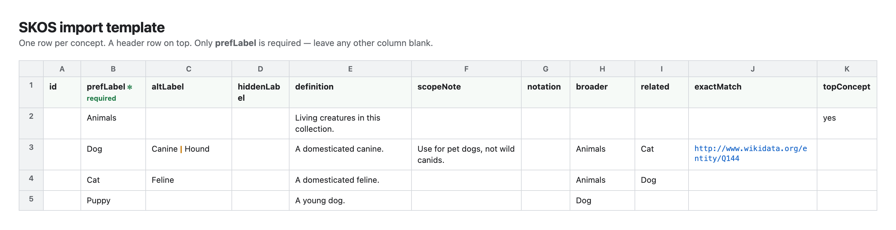
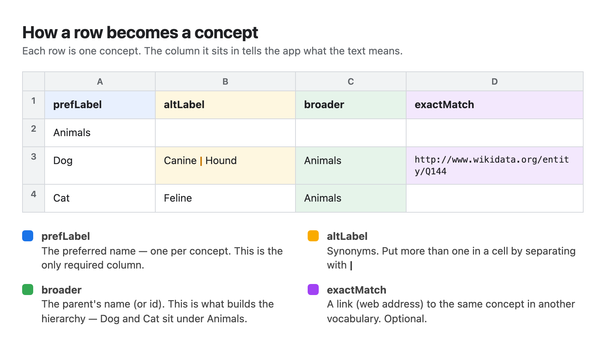

# Building a taxonomy in a spreadsheet

You don't have to write RDF by hand to start a SKOS taxonomy. You can build it in a spreadsheet — Excel, Google Sheets, Numbers, anything that saves CSV or `.xlsx` — and import it into [Intentional Arrangement SKOS](https://jesstalisman-ia.github.io/intentional-arrangement-skos/). The app reads your columns, turns each row into a concept, and generates valid SKOS RDF you can then validate, visualize, and export.

The one thing a spreadsheet can't tell the app on its own is what each column *means*. That's what the template is for. Fill in the columns below and the app knows which text is a preferred label, which is a synonym, and which concept is the parent of which.

**Download the template** — [Excel `.xlsx`](templates/skos-import-template.xlsx) (opens as a formatted grid) or [CSV](templates/skos-import-template.csv). You can also get the CSV from inside the app: open **Import**, then click *Download the CSV template*.

## The columns

One row per concept. A header row on top. Only `prefLabel` is required; leave any column you don't need empty or drop it entirely. Column names are case-insensitive, and spaces or underscores in them are ignored (`prefLabel`, `Pref Label`, and `pref_label` all work).

| Column | What it holds |
|---|---|
| `id` | Optional. A stable short identifier for the concept. Leave it blank and the app makes one from the label. |
| `prefLabel` | **Required.** The preferred label — the one name you'd show first. |
| `altLabel` | Synonyms and other accepted terms. |
| `hiddenLabel` | Terms you want searchable but not shown — common misspellings, old names. |
| `definition` | What the concept means. |
| `scopeNote` | A note on how and when to use it. |
| `changeNote` | A note about a change made to the concept (administrative). |
| `historyNote` | A note about the concept's past form or meaning. |
| `editorialNote` | A note for editors and maintainers. |
| `example` | An example of the concept in use. |
| `lang` | The language for this row's labels and notes when they carry no tag — a **BCP&nbsp;47 / ISO&nbsp;639** code like `nl`, `en`, `de`, or `nl-BE`. Optional; see [Language](#language) below. |
| `notation` | A code or classification number, if you use one. |
| `broader` | The parent concept. This is how you build the hierarchy. |
| `narrower` | Children, if you'd rather list them from the parent's row instead of setting `broader` on each child. |
| `related` | A concept that belongs alongside this one without being its parent or child. |
| `exactMatch`, `closeMatch`, `broadMatch`, `narrowMatch`, `relatedMatch` | Links to concepts in someone else's vocabulary, written as full web addresses (IRIs). |
| `topConcept` | Put `yes` on the concepts that sit at the top of the tree. Optional — the app also treats any concept with no parent as a top concept. |

## The two rules that matter

**Naming a parent.** In the `broader` column, write the parent's `prefLabel` (or its `id` if you gave it one). In the template, `Dog` has `Animals` in its `broader` column, so Dog ends up under Animals. If you name a parent that doesn't have its own row, the app creates a simple concept for it so the hierarchy stays intact, and tells you how many it added.

**Putting more than one value in a cell.** Separate multiple values with a vertical bar, ` | `. In the template, `Dog` has `Canine | Hound` in `altLabel`, so it gets both synonyms. The same works for `broader`, `related`, and the match columns.

## Language

SKOS labels and notes are language-tagged, following **BCP&nbsp;47** (ISO&nbsp;639 language codes, with optional ISO&nbsp;3166 region and ISO&nbsp;15924 script subtags — `nl`, `en-GB`, `nl-BE`, `zh-Hans`). You set the language three ways, most specific wins:

1. **Per cell.** Tag any single value with `@` and a code: `Hond@nl`, `Dog@en`, `名前@ja`. A tagged cell keeps that language no matter what else is set.
2. **Per row.** Put a code in the `lang` column and every untagged label and note in that row takes it.
3. **The import default.** When you import, the dialog shows a **language** box — it starts from your scheme's language, and whatever you set there fills in every label that has no tag of its own.

So if you work in Dutch, set the import language to `nl` (or give your scheme a `nl` language first) and your terms come in as `@nl`, not `@en`. Mix languages freely by tagging the cells or rows that differ.

## Importing it

1. Save your sheet as CSV or `.xlsx`.
2. Open the app and click **Import**.
3. Choose your file. A `.xlsx` is unzipped in your browser and shown as CSV so you can look it over first.
4. Check the **language** box (see [Language](#language)) — it defaults to your scheme's language.
5. Click **Import**. Your taxonomy loads as a new project — nothing you already have is overwritten — or choose *Merge into the current project*.

Everything happens in your browser. No file is uploaded anywhere.

## It round-trips

The import columns are the same ones the app **exports**. On the Export tab you can save your taxonomy as **CSV** or **Excel (.xlsx)** — the Excel file is built in your browser, no upload — so you can export what you've built, edit it in a spreadsheet, and import it back. The spreadsheet is a way in and a way out, not a trap.

One limit worth naming: CSV and `.xlsx` are flat views for people. RDF forms (Turtle, RDF/XML, JSON-LD, RDF/JSON) carry the full detail without loss. Treat the spreadsheet as a comfortable place to draft and edit, and one of the RDF exports as the version of record.

See also the [SKOS reference](skos-reference.md) for what each of these fields means in the standard.
