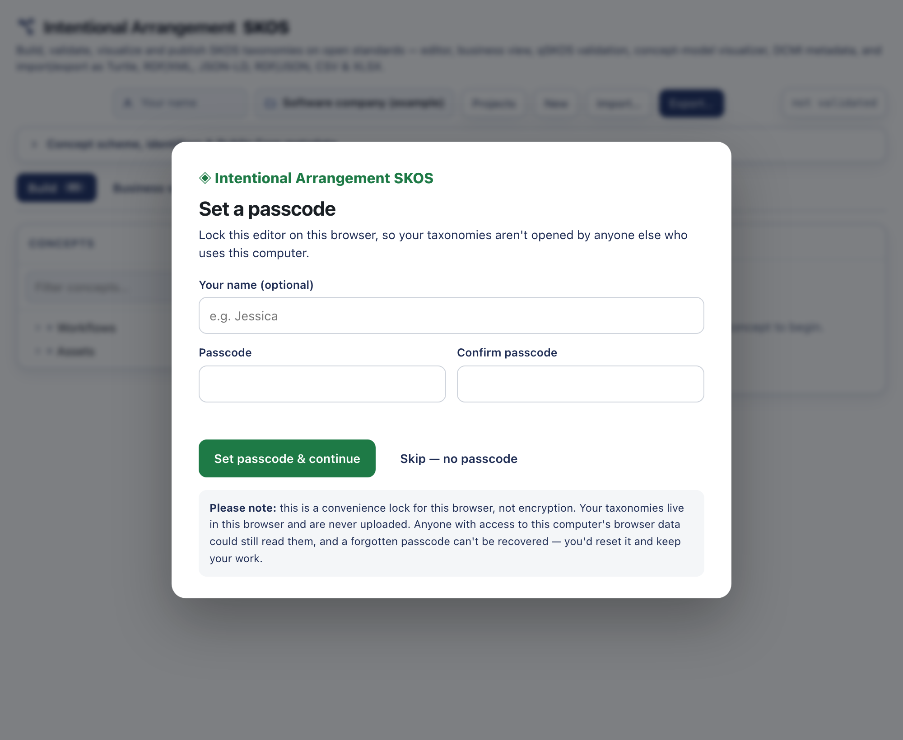
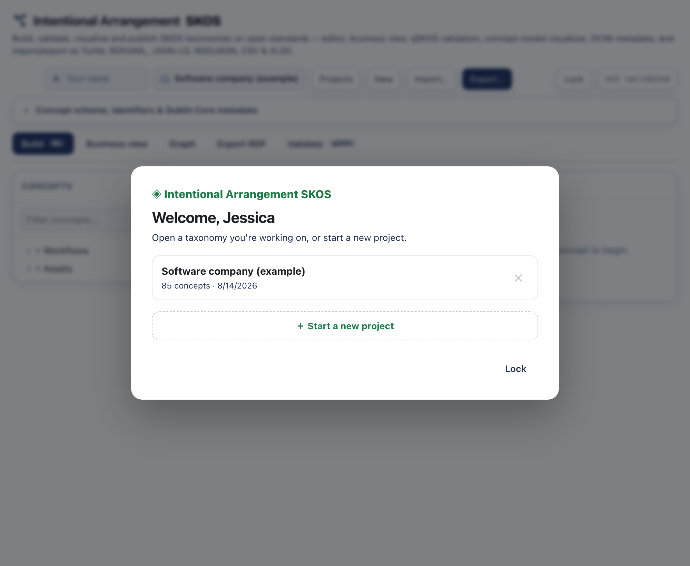
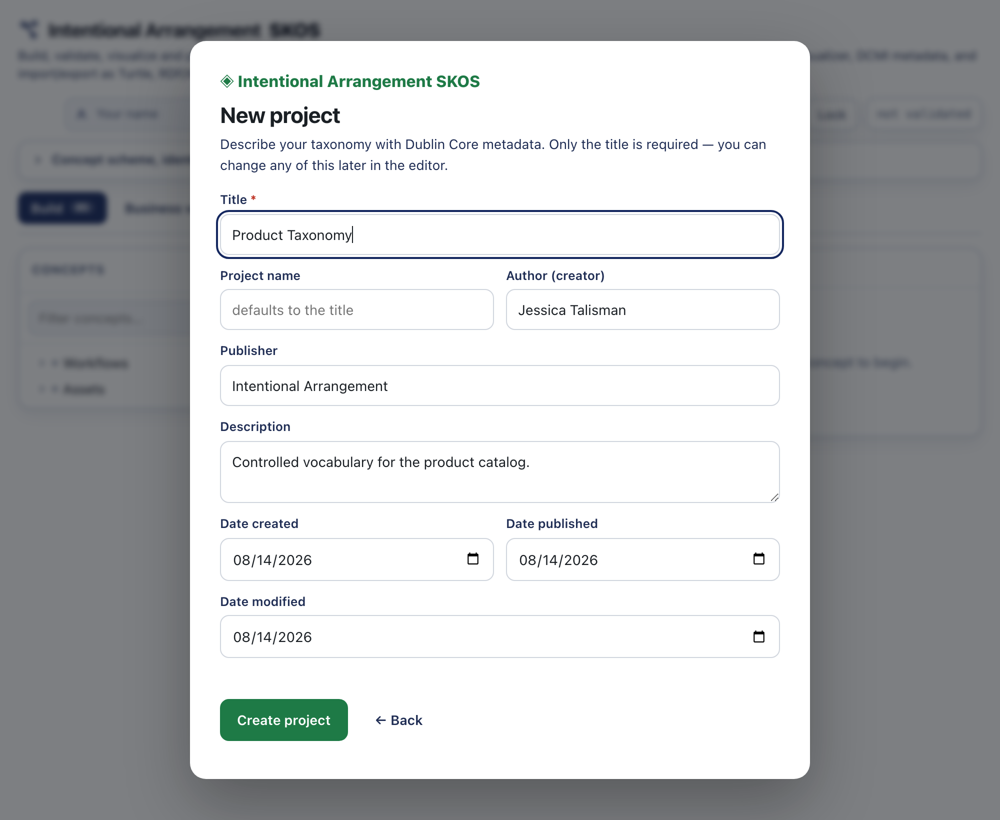

# Your workspace: passcode, projects, and autosave

The editor keeps your taxonomies for you. You can hold several at once, switch between them, and pick up where you left off — all in your browser. Nothing is uploaded to a server, and there's no account to create. This page covers how that works.

## First run: set a passcode (optional)

The first time you open the editor, it offers to set a passcode.

The passcode locks the editor on this browser, so someone else using the same computer can't open your taxonomies. A few things to be clear about:

- It is a **convenience lock, not encryption.** Your taxonomies live in this browser and are never uploaded. Anyone with access to this computer's browser data could still read them.
- It works **per browser and per device.** It does not sync — a passcode you set on your laptop doesn't apply on your phone.
- There is **no recovery** for a forgotten passcode. "Forgot passcode?" simply resets it; your work stays.

You can **Skip — no passcode** and use the editor without one. If you set one, you'll see a **Lock** button in the header, and "Keep me signed in on this browser" decides whether you're asked for it again next time.

## The welcome screen

After you're in, the welcome screen lets you open a taxonomy you're already working on or start a fresh one.

- **Open** a taxonomy by clicking it.
- **Delete** one with the ✕ (you'll be asked to confirm).
- **Start a new project** with the button below the list.

You can return to this screen anytime by clicking the **Intentional Arrangement SKOS** logo in the header.

## Starting a project with Dublin Core metadata

A new project begins with its metadata, described in Dublin Core. This is what makes the vocabulary a document someone can name, cite, and trust.

- **Title** is the only required field.
- **Project name** is the label in your list — it defaults to the title.
- **Author (creator)**, **Publisher**, and **Description** are optional.
- **Date created**, **Date published** (`dcterms:issued`), and **Date modified** are filled in with today's date and can be changed.

You can edit any of this later in the editor, under **Concept scheme, identifiers & Dublin Core metadata**. All of it travels with your exports — Turtle, RDF/XML, JSON-LD, and the rest.

## Autosave and multiple projects

Every change you make is **saved automatically** to your browser. A small **✓ Saved** appears in the header when it happens — there is no save button to remember. Your projects sit side by side; switching between them never loses work.

To manage projects beyond the welcome screen, use **Projects** in the header: open, rename, duplicate, or delete any of them.

## Where your work lives, and how to move it

Everything is stored in this browser's local storage — private to you, on this device. That also means it doesn't follow you to another computer on its own. To move a taxonomy, or to keep a backup, **export** it (Turtle is the lossless default) and **import** it wherever you need it. See [building a taxonomy in a spreadsheet](spreadsheet-import.md) for the spreadsheet round-trip, and the [install guide](install.md) for running or hosting the editor.
